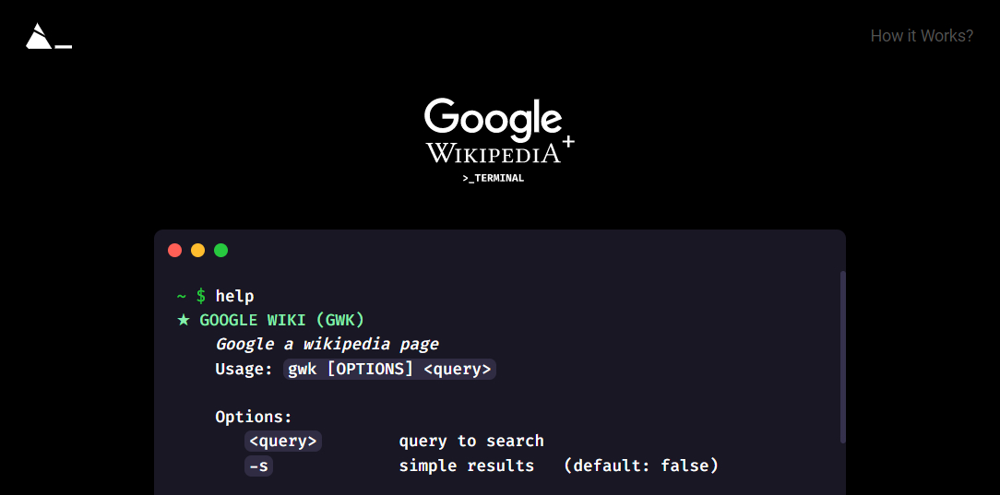

# Google Clone


`google-clone-frontend`

A Google clone that searches for Wikipedia Articles based on a Terminal simulation



# Frontend

## How to Run

### Install the dependencies

```bash
yarn
# or
npm install
```

### Start the app in development mode (hot-code reloading, error reporting, etc.)

```bash
npx quasar dev
```

## Backend

To learn more about the backend, follow the
[backend repository](https://github.com/megomes/google_clone_backend)

# Contribute

## Add more commands

The CommandController implements a [Command Pattern](https://refactoring.guru/design-patterns/command).

To create more commands, create a new `_____Command.ts` inside the [`./src/models/Commands`](./src/models/Commands/) folder following the [`Terminal Command Abstract Class`](./src/models/TerminalCommandAbstract.ts) implementing these main objects/functions:

```ts
function execute(): void { }

function break(): void { }

config: CommandConfig = {
  title: 'TITLE',
  description: 'DESCRIPTION',
  usage: ['CMD [OPTIONS] <QUERY>'],
  options: [
    {
      minified: 'MINIFIED OPTION',
      normal: 'NORMAL OPTION',
      description: 'OPTION DESCRIPTION',
      default: 'DEFAULT VALUE',
      type: CommandTypes.TYPE,
      required: REQUIRED,
    },
  ],
};

```
